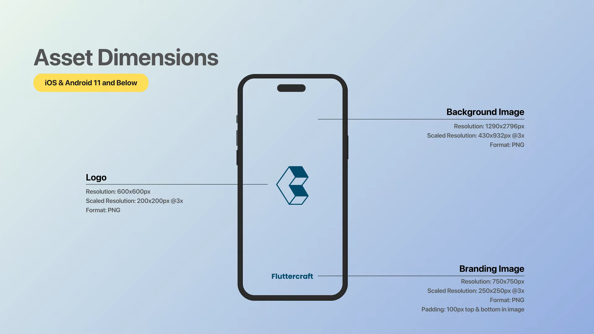
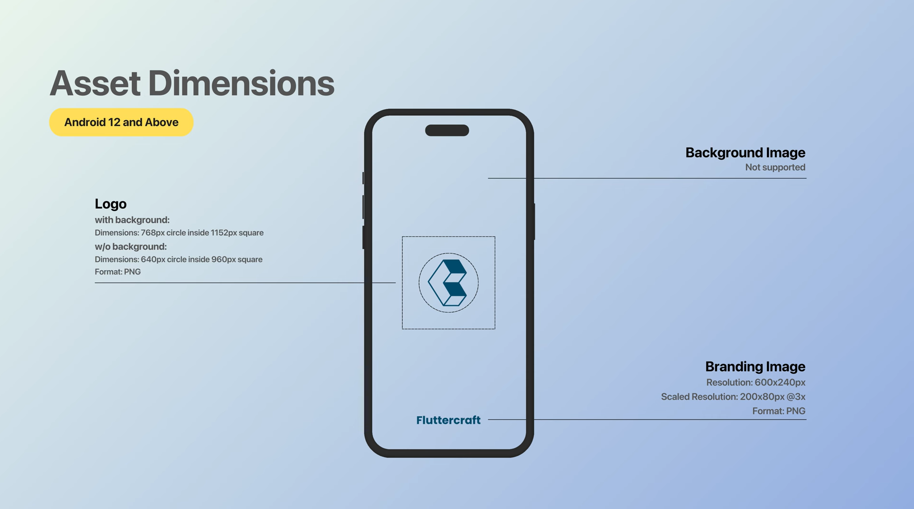

# Flutter Splash Screen Setup

## 1. Prepare the Images:
- Add the background, icon, and brand images for the splash screen under the `assets/image` directory by creating appropriate subfolders.
- Define these images in the `pubspec.yaml` file and run `flutter pub get` in the terminal.

## 2. Install the `flutter_native_splash` Package:
- Add the `flutter_native_splash` package to the `dependencies` section of your `pubspec.yaml` file.
- Run `flutter pub get` again in the terminal.

## 3. Create the `native_splash_screen.yaml` File:
- You will customize the splash screen settings in this file.
- Define the splash screen colors, images, and other settings in this file.

## 4. Update the Splash Screen:
Run the following command in the terminal: 
`flutter pub run flutter_native_splash --path=native_splash_screen.yaml`

  
## 5. Image Settings:
- For IOS and Android 11 and below devices, use this image:
  
- For Android 12 and above devices, use this image:
  

## 6. Navigation After Splash Screen:
Handle the navigation and coding after the splash screen using the `flutter_native_splash` package:
- In the `main()` function, use `FlutterNativeSplash.preserve()` to keep the splash screen.
- Add a delay (`Future.delayed()`) in the `initState()` before navigating to the main screen.
- After the delay completes, call `FlutterNativeSplash.remove()` to remove the splash screen and proceed to the main screen.

